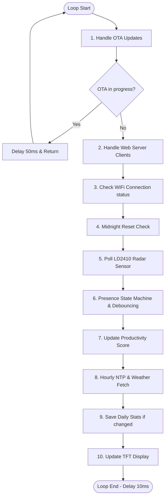
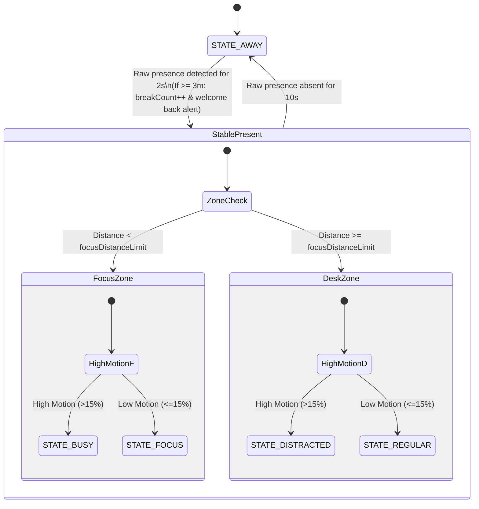
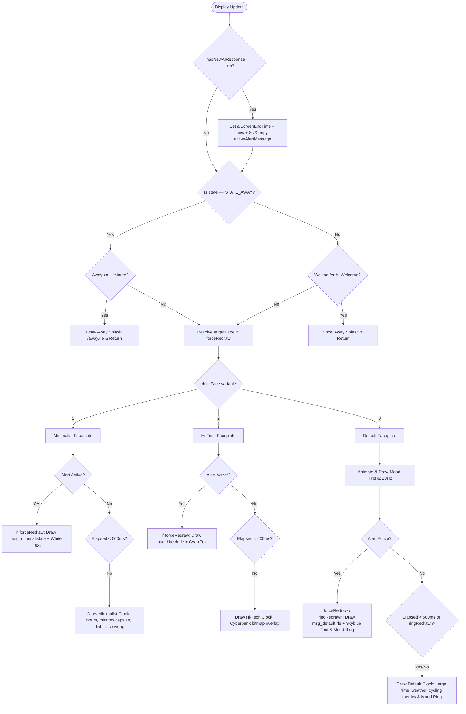

# DeskBuddy Architecture, Flowcharts & Variables Inventory

This document provides a comprehensive analysis of the inner workings of DeskBuddy. It serves as an architectural blueprint for Miro flowcharts, detailing the execution sequence, state transitions, metric calculations, and variable inventories.

---

## 1. Main Loop Execution Sequence

The `loop()` function in [main.cpp](file:///c:/Users/danme/Documents/PlatformIO/Projects/DeskBuddy/src/main.cpp#L371) orchestrates all background tasks, sensor polling, state logic, and UI updates.




### Main Loop Sequence Deep Dive:
1. **Handle OTA Updates**: Calls `ArduinoOTA.handle()`. The global volatile boolean `otaInProgress` is toggled by OTA start/end callbacks. If true, the loop delays 50ms and returns immediately, pausing standard loop execution to ensure a safe, flash-write operation without display interruptions.
2. **Handle Web Server Clients**: Calls `server.handleClient()`. This is non-blocking. It processes client TCP connections, executes registered endpoint callbacks (e.g. settings updates, data fetches), and keeps the web page dashboard alive.
3. **Check WiFi Connection**: Runs every 10 seconds. If `WiFi.status()` is not `WL_CONNECTED`, it disconnects, re-initializes static IP parameters (`local_IP`, `gateway`, `subnet`, `primaryDNS`, `secondaryDNS`), and calls `WiFi.begin(SSID, PASS)`. This guarantees reconnection with static configuration instead of reverting to DHCP.
4. **Midnight Reset Check**: Polls standard local time via the NTP Client. Compares the current day (`timeClient.getDay()`) with `lastNtpDay`. If they differ (and WiFi is connected/time is successfully synchronized):
   - Resets all daily accumulators (desk time, breaks, streaks, request counters).
   - Resets session metrics.
   - Sets `firstSitToday = true`.
   - Forces a call to `saveDailyStats()` to persist the reset state to LittleFS.
5. **Poll LD2410 Radar Sensor**: Calls `radar.read()` to query the physical sensor's buffer. Every 100ms (10Hz frequency check):
   - Feeds the current moving target status (0 or 1) into `motionFilter` (size 10 rolling median). If the median is $> 0.5$, sets `sensorMovingTargetDetected = true`.
   - If raw distance is $> 0$, feeds it into `detectionDistFilter` (size 100 rolling median) and computes `filteredDetectionDist` using a window size of `filterWindow * 10` (clamped between 1 and 100).
   - Accumulates raw distance into `sessionDistanceSum` and `sessionDistanceCount` to update `sessionDistanceAverage`.
6. **Presence State Machine**: Resolves the user's current physical state, handles debounce limits, updates daily accumulators, and triggers behaviour actions.
7. **Update Productivity Score**: Re-computes the running productivity score relative to `firstSitEpoch` and updates `productivityScore` (constrained between 0-100%).
8. **Hourly NTP & Weather Fetch**: Every 3,600,000ms (1 hour), triggers `timeClient.update()` and sends an HTTP GET request to the OpenWeather API to retrieve local temperature (`temp`) and weather description (`weatherDesc`).
9. **Save Daily Stats**: Every 60,000ms (1 minute), checks if any daily metric has changed since the last save. If so, calls `saveDailyStats()` to write stats JSON to LittleFS.
10. **Update TFT Display**: Refreshes bezel ring animation transition states at 20Hz (every 50ms) and invokes the active faceplate drawing callbacks in [Faceplates.h](file:///c:/Users/danme/Documents/PlatformIO/Projects/DeskBuddy/src/Faceplates.h) at a throttled rate of 500ms (or immediately if a state change or new alert occurs).

---

## 2. Presence State Machine & Zones

The radar sensor classifies user presence based on two parameters: **Distance** (from sensor) and **Motion** (ratio of motion time to desk time). 




### Presence State Machine Deep Dive:
* **Zone Decision Matrix**:
  - **Present**: Distance is $< \text{deskDistanceLimit}$ (default 120cm) and stable presence is active.
  - **Focus Zone**: Distance is $< \text{focusDistanceLimit}$ (default 50cm).
  - **High Motion**: `motionRatio = (sessionMotionTime * 100) / sessionDeskTime > motionRatioLimit` (default 15%).
  - **State Assignments**:
    - `STATE_FOCUS`: Inside Focus Zone and Low Motion.
    - `STATE_BUSY`: Inside Focus Zone and High Motion.
    - `STATE_REGULAR`: Outside Focus Zone and Low Motion.
    - `STATE_DISTRACTED`: Outside Focus Zone and High Motion.
    - `STATE_AWAY`: No presence detected.
* **Debouncing & Grace Periods**:
  - **Presence Jitter Debounce**: Transition from `STATE_AWAY` to present takes **2 seconds** of continuous raw detection. Transition to `STATE_AWAY` takes **10 seconds** of continuous raw absence.
  - **Display Away Grace Period**: When a transition to `STATE_AWAY` is confirmed, the state machine immediately updates backend metrics (such as beginning to accumulate break time), but **delays updating the display to the Away splash screen for 1 minute (60,000ms)**. During this minute, the active clock face continues to display normally.
* **Absence Transition Rules (Away -> Present)**:
  - When raw presence is confirmed after an away period, the duration of the absence is calculated: `breakDuration = now - lastStateTransitionTime`.
  - **First Sit of the Day**: If `firstSitToday` is true, sets `firstSitToday = false`, sets `firstSitEpoch` to NTP epoch time, calculates `overnightBreakDuration = firstSitEpoch - lastAwayEpoch` (if `lastAwayEpoch > 0`), and triggers `EVENT_FIRST_SIT`.
  - **Absences $\ge$ 3 Minutes (180,000ms)**: Counted as a real break. Increments `breakCount`, sets `latestBreakDuration = breakDuration`, triggers `EVENT_WELCOME_BACK`, and resets all session-specific distance/motion accumulators.
  - **Absences $<$ 3 Minutes (Lieu Time Check)**: Treated as a minor grace absence. The transition does NOT increment `breakCount`, does NOT trigger any welcome back alert, and does NOT reset session metrics. However, because `totalDeskTime` was not accumulating during the absence, this away time naturally counts against desk sitting time and remains in `totalBreakTime`, allowing multiple brief absences to correctly lower the productivity score.
* **Absence Transition Rules (Present -> Away)**:
  - If previous state was `STATE_FOCUS`, calculates `focusSessionDuration = now - continuousStillStart`.
  - If `focusSessionDuration > 15000ms` (15 seconds), triggers `EVENT_FOCUS_END`.
  - Sets `currentPresenceState = STATE_AWAY`, records `lastAwayEpoch` to current NTP epoch, and saves daily stats to LittleFS.

---

## 3. Behavioural Events & Gemini AI Triggers

When the state machine registers specific transitions or durations, it calls `triggerBehaviour()` in [Gemini.h](file:///c:/Users/danme/Documents/PlatformIO/Projects/DeskBuddy/src/Gemini.h#L131).


### Behavioural & AI Triggers Deep Dive:
* **AI Configuration Levels**:
  - If `aiMode == 2` (Frequent): All triggered events query the Gemini model.
  - If `aiMode == 1` (Balanced): Only `EVENT_FIRST_SIT`, `EVENT_WELCOME_BACK`, and `EVENT_STRETCH` query Gemini; other events use local fallbacks.
  - Daily Request Cap: If `dailyAiRequestCount >= 15` is reached, all event triggers bypass the AI logic and use local fallbacks immediately to save API token costs.
* **Asynchronous FreeRTOS Task Execution**:
  - Copies prompt templates from `Behaviour.h` and formats them with contextual metrics (userName, totalDeskTime, totalFocusTime, breakCount, productivityScore).
  - Sets `isAILoading = true` and spawns a FreeRTOS task `queryGeminiTask` with a stack size of 8192 bytes and priority 1.
  - The task initializes a `WiFiClientSecure` client and calls `setInsecure()` to disable SSL certificate verification (speeding up handshakes on local microcontrollers).
  - Sends a secure HTTPS POST payload to the Gemini API (`v1beta/models/gemini-2.5-flash`).
  - If the HTTP response is 200, parses the JSON payload, trims the generated text (removes surrounding quotes), takes `geminiMutex` lock, updates the global `aiResponse` string, flags `hasNewAIResponse = true`, releases the mutex, and terminates itself via `vTaskDelete(NULL)`.
* **Local Fallback Handler**:
  - If the HTTPS request fails, or if AI mode is disabled/capped:
  - Picks a random quote (1 of 20) for the current category from the arrays in `Behaviour.h`.
  - Replaces the string placeholder with `userName` via `personalizeQuote()`.
  - Thread-safely takes `geminiMutex`, sets `lastResponseIsAi = false`, writes the personalized quote to `aiResponse`, sets `hasNewAIResponse = true`, and releases the mutex.

---

## 4. Screen Rendering & Priority

Screen rendering is handled in `updateTFTDisplay(now)` inside [Display.h](file:///c:/Users/danme/Documents/PlatformIO/Projects/DeskBuddy/src/Display.h#L179). Normal clock updates are throttled to 500ms, while page changes and alert triggers fire immediately. Each faceplate is responsible for drawing its own normal clock layout and custom styled alert screens.




### Screen Rendering Deep Dive:
* **Page Hierarchy & Redraw Triggers**:
  - **Highest Priority: Active Alerts**: If `hasNewAIResponse` is true, thread-safely copies the response, sets `aiScreenEndTime = now + 8000` (holding the alert screen for 8 seconds), and flags a new alert page.
  - **Page Resolution**:
    - `-1` (Away page): If `currentPresenceState == STATE_AWAY` AND `now - lastStateTransitionTime >= 60000ms` (1-minute grace period has expired).
    - `-2` (Alert page): If `now < aiScreenEndTime` is active.
    - `0` (Clock page): If present, OR if away but within the 1-minute grace period.
  - **Force Redraw Flag**: A boolean `forceRedraw` is evaluated and passed to the active faceplate. It becomes true if the display page changes, the user presence state changes, the clockFace selection changes, or a new alert arrives.
* **Modular Drawing Execution**:
  - **Away Splash (`targetPage == -1`)**: Clears the screen and draws the `/away.rle` splash screen (once).
  - **Faceplate Rendering (`targetPage == 0` or `-2`)**: Invokes the drawing callback associated with `clockFace`:
    - **Default Digital Faceplate** (`drawDefaultClockFace`):
      - Handles the bezel ring color transition: Computes transitions at 20Hz (every 50ms) using a cosine ease-in-out curve over 1 second.
      - If `showEvent` is true (Alert Mode): Draws `/msg_default.rle` background, wraps the alert text in the center, and draws the current antialiased bezel ring color on top.
      - If `showEvent` is false: Throttled to 500ms (unless the bezel ring is actively transitioning). Draws weather data at Y=50, large digital time at Y=105, date at Y=150, cycling stats at Y=190, and a yellow envelope mail icon at X=200, Y=46 if `hasMail` is active.
    - **Minimalist Faceplate** (`drawMinimalistClockFace`):
      - If `showEvent` is true: Draws `/msg_minimalist.rle` and wrapped text in white.
      - If `showEvent` is false: Throttled to 500ms. Erases and draws the dial ticks ring on minute transitions, draws hours and a minutes capsule, draws status icons at Y=53, and a white mail envelope at X=152, Y=53 if `hasMail` is active.
    - **Hi-Tech Faceplate** (`drawHiTechClockFace`):
      - If `showEvent` is true: Draws `/msg_hitech.rle` and wrapped text in cyan (`HITECH_CYAN`).
      - If `showEvent` is false: Throttled to 500ms. Overlays time (using smooth `GoodTiming46` font at `Y = 56`, cleared via `fillRect(52, 65, 134, 36)`), day of the week and date (using smooth `GoodTiming15` font at `Y = 106`, cleared via `fillRect(67, 108, 34, 13)` and `fillRect(113, 108, 54, 13)`), temperature (using smooth `GoodTiming15` font at `Y = 19`, degree circle at `Y = 24`, cleared via `fillRect(138, 21, 40, 13)`), sitting/away hours (using smooth `GoodTiming20` font at `Y = 142`, cleared via `fillRect(71, 150, 36, 16)` and `fillRect(134, 150, 36, 16)`), status icons, and a cyan mail envelope at X=112, Y=20 if `hasMail` is active on top of the `/hitech.rle` dashboard image.

---

## 5. Metrics Calculations

The **Productivity Score** is dynamically computed relative to the start of the workday (`firstSitEpoch`):

$$\text{Productivity Score} = 100 - \text{Break Frequency Penalty} - \text{Break Duration Penalty} + \text{Focus Bonus}$$

### Metrics Calculations Deep Dive:
1. **Break Frequency Penalty**:
   $$\text{Penalty} = 25 \times \left( \frac{\text{breakCount}}{\text{Hours Worked}} \right)$$
   *(Each break taken relative to elapsed work hours incurs a 25% penalty. Target: 1 break/hour = 25% penalty)*
2. **Break Duration Penalty**:
   $$\text{Penalty} = 25 \times \left( \frac{\text{Active Break Time Ratio}}{10\%} \right)$$
   *(Active break ratio is computed as: `activeBreakMs = workdayElapsedMs - totalDeskTime`. Each 10% of the workday spent away from the desk yields a 25% penalty. Mini-absences $< 3$ minutes are not credited back to `totalDeskTime`, which naturally increases the break ratio and penalizes this metric)*
3. **Focus Bonus**:
   $$\text{Bonus} = 1.5 \times \left( \frac{\text{totalFocusTime} \times 100}{\text{totalDeskTime}} \right)$$
   *(Deep focus time where distance is $< \text{focusDistanceLimit}$ and motion is low counts as a positive $1.5\times$ weight to boost the overall productivity score)*

---

## 6. Data & Variables Inventory

Here is the centralized list of configurations, status indicators, and parameters mapped across different segments of DeskBuddy.

### A. Variables Exposed to the Web Interface
These values are synchronized through the REST API `/api/stats` and form POST `/save-settings` defined in [Web.h](file:///c:/Users/danme/Documents/PlatformIO/Projects/DeskBuddy/src/Web.h):

| JSON Key | Type | Description / Destination |
| :--- | :--- | :--- |
| `aiMode` | `int` | AI triggering setting (0 = Eco/Off, 1 = Balanced, 2 = Frequent) |
| `clockFace` | `int` | Current faceplate page style (0 = Default, 1 = Minimalist, 2 = Hi-Tech) |
| `userName` | `String` | Personalized username referenced by the AI model and local fallbacks |
| `targetHours` | `float` | Target workday hours used to compute the workday percentage |
| `focusDistLim` | `int` | Radial limit (cm) within which the user is classified in the Focus zone |
| `motionRatioLim` | `int` | Motion threshold ratio (%) above which user is classified in High Motion |
| `distLimit` | `int` | Maximum radar detection distance limit (cm) |
| `filterWindow` | `float` | Window size (seconds) used for distance rolling median filtering |
| `hasMail` | `bool` | Toggle state representing active mail alerts |
| `score` | `int` | Current running productivity score percentage (0-100%) |
| `aiMessage` | `String` | Last text returned by Gemini AI or localized fallbacks |
| `isAiGenerated` | `bool` | True if the current response text was generated dynamically by the LLM |
| `aiLoading` | `bool` | True if a background HTTPS query is currently processing in FreeRTOS |
| `movingTarget` | `bool` | Live radar motion presence indicator |
| `detectionDist` | `int` | Live filtered distance measurement (cm) |
| `deskTime` / `focusTime` | `String` | Formatted daily accumulators for sitting and focusing durations |
| `g0mSens` to `g6sSens` | `int` | Motion/static gate sensitivity thresholds (0-100) on the LD2410 sensor |

---

### B. Variables Stored in LittleFS (Daily Statistics)
Committed to `/stats.json` in flash memory every 60 seconds (or immediately upon first sit or break transitions) using an atomic rename write pattern inside `saveDailyStats()` in [main.cpp](file:///c:/Users/danme/Documents/PlatformIO/Projects/DeskBuddy/src/main.cpp#L199):

| JSON Key | Type | Variable in Code |
| :--- | :--- | :--- |
| `firstSitToday` | `bool` | `firstSitToday` |
| `firstSitEpoch` | `uint32_t` | `firstSitEpoch` |
| `breakCount` | `int` | `breakCount` |
| `totalDeskTime` | `unsigned long` | `totalDeskTime` |
| `totalFocusTime` | `unsigned long` | `totalFocusTime` |
| `totalBreakTime` | `unsigned long` | `totalBreakTime` |
| `overnightBreakDuration` | `unsigned long` | `overnightBreakDuration` |
| `lastAwayEpoch` | `uint32_t` | `lastAwayEpoch` |
| `dailyAiRequestCount`| `int` | `dailyAiRequestCount` |
| `lastNtpDay` | `int` | `lastNtpDay` |
| `longestSittingStreak` | `unsigned long` | `longestSittingStreak` |
| `userName` | `String` | `userName` |
| `deskDistanceLimit` | `int` | `deskDistanceLimit` |
| `focusDistanceLimit` | `int` | `focusDistanceLimit` |
| `motionRatioLimit` | `int` | `motionRatioLimit` |
| `hasMail` | `bool` | `hasMail` |

---

### C. Variables Stored in Preferences (Non-Volatile Flash)
Persistent configurations saved to the ESP32 Preferences namespace `"deskbuddy"` when saving settings through the web panel:

* `aiMode` (`int`)
* `clockFace` (`int`)
* `targetHours` (`float`)
* `userName` (`String`)
* `focusDistLim` (`int`)
* `motionRatioLim` (`int`)
* `distLimit` (`int`)
* `filterWindow` (`float`)
* `hasMail` (`bool`)
* `g0mSens` through `g6sSens` (`int` - radar gate sensitivities)

---

### D. Display Payload Parameters
Parameters passed from `updateTFTDisplay(now)` in [Display.h](file:///c:/Users/danme/Documents/PlatformIO/Projects/DeskBuddy/src/Display.h) to the modular drawing functions in [Faceplates.h](file:///c:/Users/danme/Documents/PlatformIO/Projects/DeskBuddy/src/Faceplates.h):

```cpp
void drawXClockFace(
    unsigned long now,          // Current system ticks in milliseconds
    bool forceRedraw,           // Request to clear buffers and redraw static backgrounds
    bool showEvent,             // True if an event message/alert should be shown
    const String &message,      // The active response/alert text to wrap and draw
    bool isAi,                  // True if the active response was generated by Gemini
    bool wifiAvailable,         // Live WiFi connection status (WiFi.status() == WL_CONNECTED)
    bool internetAvailable,     // Live Internet/NTP synced availability status
    bool hasMail                // Live Mail notification alert status
);
```
These parameters abstract display logic away from direct hardware libraries (`WiFi` or `NTPClient`), making the individual faceplates cleanly modularized.
