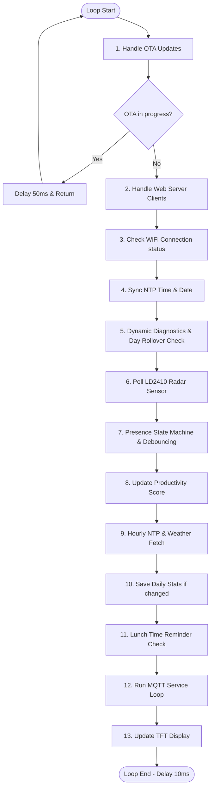
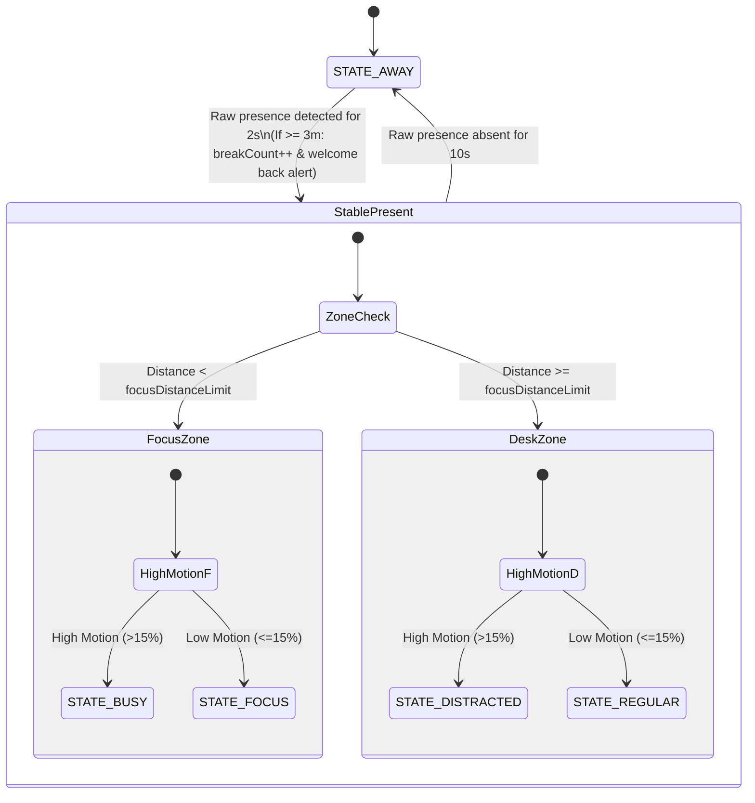
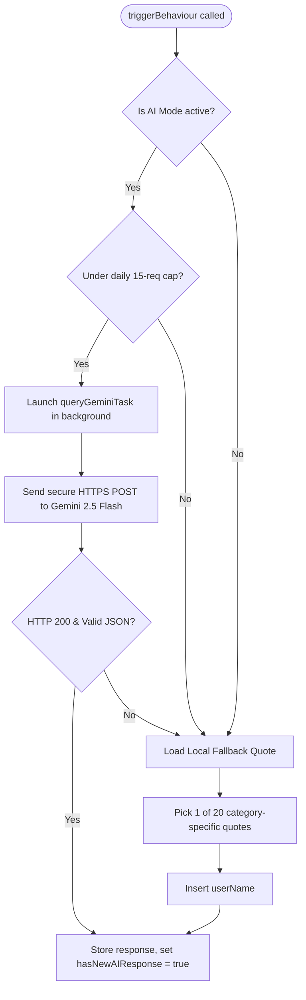
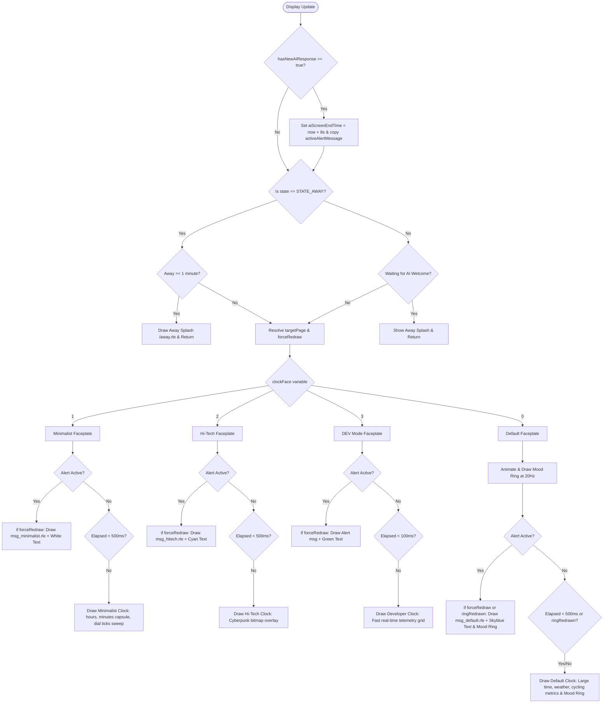

# DeskBuddy Architecture, Flowcharts & Variables Inventory

This document provides a comprehensive analysis of the inner workings of DeskBuddy. It serves as an architectural blueprint for Miro flowcharts, detailing the execution sequence, state transitions, metric calculations, and variable inventories.

---

## 1. Main Loop Execution Sequence

The `loop()` function in [main.cpp](file:///c:/Users/danme/Documents/PlatformIO/Projects/DeskBuddy/src/main.cpp#L487) orchestrates all background tasks, sensor polling, state logic, and UI updates.





### Main Loop Sequence Deep Dive:
1. **Handle OTA Updates**: Calls `ArduinoOTA.handle()`. The global volatile boolean `otaInProgress` is toggled by OTA start/end callbacks. If true, the loop delays 50ms and returns immediately, pausing standard loop execution to ensure a safe, flash-write operation without display interruptions.
2. **Handle Web Server Clients**: Calls `server.handleClient()`. This is non-blocking. It processes client TCP connections, executes registered endpoint callbacks (e.g. settings updates, data fetches), and keeps the web page dashboard alive.
3. **Check WiFi Connection**: Runs every 10 seconds. If `WiFi.status()` is not `WL_CONNECTED`, it disconnects, re-initializes static IP parameters (`local_IP`, `gateway`, `subnet`, `primaryDNS`, `secondaryDNS`), and calls `WiFi.begin(SSID, PASS)`. This guarantees reconnection with static configuration instead of reverting to DHCP.
4. **Sync NTP Time & Date**: Verifies that time client is sync'ed, updating the local time variables and buffering standard date string formatting.
5. **Dynamic Diagnostics & Day Rollover Check**: Updates `lastMidnightCheckDay` to verify if the day has changed since the last sync. Unlike a fixed midnight reset, statistics do not reset automatically at 12:00 AM. Instead, day session rollover checks are performed dynamically when the user sits down after a break (Transition: Away -> Present), allowing active workdays to naturally span past midnight. Also resets file system read/write counts at midnight.
6. **Poll LD2410 Radar Sensor**: Calls `radar.read()` to query the physical sensor's buffer. Every 100ms (10Hz frequency check):
   - Feeds the current moving target status (0 or 1) into `motionFilter` (size 10 rolling median). If the median is $> 0.5$, sets `sensorMovingTargetDetected = true`.
   - If raw distance is $> 0$, feeds it into `detectionDistFilter` (size 100 rolling median) and computes `filteredDetectionDist` using a window size of `filterWindow * 10` (clamped between 1 and 100).
   - Accumulates raw distance into `sessionDistanceSum` and `sessionDistanceCount` to update `sessionDistanceAverage`.
7. **Presence State Machine**: Resolves the user's current physical state, handles debounce limits, updates daily accumulators, and triggers behaviour actions.
8. **Update Productivity Score**: Re-computes the running productivity score relative to `firstSitEpoch` and updates `productivityScore` (constrained between 0-100%).
9. **Hourly NTP & Weather Fetch**: Every 3,600,000ms (1 hour), triggers `timeClient.update()` and sends an HTTP GET request to the OpenWeather API to retrieve local temperature (`temp`) and weather description (`weatherDesc`).
10. **Save Daily Stats**: Every 600,000ms (10 minutes), checks if any daily metric has changed since the last save. If so, calls `saveDailyStats()` to write stats JSON to LittleFS.
11. **Lunch Time Reminder Check**: If the hour matches the learned lunch hour index, the user has been active for over 30 minutes, and the reminder hasn't been triggered yet, it saves stats and triggers `EVENT_LUNCH_REMINDER`.
12. **Run MQTT Service Loop**: Calls `loopMqtt()` from [MqttService.h](file:///c:/Users/danme/Documents/PlatformIO/Projects/DeskBuddy/src/MqttService.h). Connects asynchronously to the MQTT broker (`192.168.15.18:1883`), subscribes to `deskbuddy/#`, manages a 50-message circular history buffer for the Web UI terminal, and processes inbound/outbound packets to maintain connection and publish telemetry messages.
13. **Update TFT Display**: Refreshes bezel ring animation transition states at 20Hz (every 50ms) and invokes the active faceplate drawing callbacks in [Faceplates.h](file:///c:/Users/danme/Documents/PlatformIO/Projects/DeskBuddy/src/Faceplates.h) at a throttled rate of 500ms (or immediately if a state change or new alert occurs).

---

## 2. Presence State Machine & Zones

The radar sensor classifies user presence based on two parameters: **Distance** (from sensor) and **Motion** (ratio of motion time to desk time).





### Presence State Machine Deep Dive:
* **Zone Decision Matrix**:
  - **Present**: Distance is $< \text{deskDistanceLimit}$ (default 120cm) and stable presence is active. Mapped inside `main.cpp` and [Learning.h](file:///c:/Users/danme/Documents/PlatformIO/Projects/DeskBuddy/src/Learning.h).
  - **Focus Zone**: Distance is $< \text{focusDistanceLimit}$ (default 50cm).
  - **High Motion**: `motionRatio = (sessionMotionTime * 100) / sessionDeskTime > motionRatioLimit` (default 15%).
  - **State Assignments**:
    - `STATE_FOCUS`: Inside Focus Zone and Low Motion.
    - `STATE_BUSY`: Inside Focus Zone and High Motion.
    - `STATE_REGULAR`: Outside Focus Zone and Low Motion.
    - `STATE_DISTRACTED`: Outside Focus Zone and High Motion.
    - `STATE_AWAY`: No presence detected.
* **Debouncing & Grace Periods**:
  - **Presence Jitter Debounce**: Transition from `STATE_AWAY` to present takes **2 seconds** of continuous raw detection. Transition to `STATE_AWAY` takes **10 seconds** of continuous raw absence.
  - **Attention Mode Stickiness**: Transitions between active presence states (`STATE_FOCUS`, `STATE_BUSY`, `STATE_DISTRACTED`, and `STATE_REGULAR`) are stabilized. A new state must remain prevalent and unchanged for at least **3 minutes (180,000ms)** before it is committed. Transitioning into or out of `STATE_AWAY` bypasses this delay to keep the system reactive.
  - **Display Away Grace Period**: When a transition to `STATE_AWAY` is confirmed, the state machine immediately updates backend metrics (such as beginning to accumulate break time), but **delays updating the display to the Away splash screen for 1 minute (60,000ms)**. During this minute, the active clock face continues to display normally.
* **Absence Transition Rules (Away -> Present)**:
  - When raw presence is confirmed after an away period, the system initiates an **adaptive session validation buffer** (`rolloverPending = true`).
    - **Adaptive Buffer Duration**:
      - If there are $< 3$ days of logged presence history, a fallback **3-minute (180s) buffer** is used.
      - If there are $\ge 3$ days of history:
        - If the sit-down occurs during typical work hours (occupancy $\ge 15\%$), a responsive **45-second buffer** is used to confirm and clear greetings quickly.
        - If the sit-down occurs during typical sleep/off-work hours (occupancy $< 15\%$), a **3-minute (180s) buffer** is used to ensure brief midnight checks do not trigger a false day start.
  - **Quick Visits (Under Buffer Limit)**: If the user leaves before the dynamic buffer expires, the validation is cancelled, telemetry resets are bypassed, and the previous bedtime departure timestamp (`lastAwayEpoch`) is preserved.
  - **Workday/Session Confirmation**: If the user remains present for the duration of the dynamic buffer, the session is officially confirmed:
    - **Inferred Work/Sleep Rollover Check**: Compares the calendar day against `lastNtpDay`. If the day has changed:
      - If there are $< 3$ days of logged presence history, a fallback **4-hour absence threshold** is used.
      - If there are $\ge 3$ days of presence history, a dynamic threshold is calculated: **3 hours** if the departure hour `lastAwayEpoch` falls in typical sleep hours (inferred as an hour with $< 15\%$ historical presence probability), or **7 hours** if departure occurred during typical work hours (occupancy $\ge 15\%$) to prevent midday breaks from resetting telemetry.
    - **Rollover Reset Execution**: If the absence exceeds the computed threshold:
      - Integrates the current day's presence accumulator `presenceMsCurrentDay[24]` into the history profile `hourlyPresenceHistory[24]` via an exponential moving average.
      - Resets daily telemetry accumulators (break counts, desk/focus time, streak counts) via `resetDailyStats()` defined in [Stats.h](file:///c:/Users/danme/Documents/PlatformIO/Projects/DeskBuddy/src/Stats.h).
      - Resets daily flags (`lunchReminderTriggered = false`) and saves stats to LittleFS.
      - Sets `firstSitToday = true` (and temporarily restores `lastAwayEpoch` so the first sit greeting can compute overnight break length).
  - **First Sit of the Day**: If `firstSitToday` is true, sets `firstSitToday = false`, sets `firstSitEpoch` to the sit-down time, calculates `overnightBreakDuration = firstSitEpoch - lastAwayEpoch` (if `lastAwayEpoch > 0`), and triggers `EVENT_FIRST_SIT`.
  - **Absences $\ge$ 3 Minutes (180,000ms)**: Counted as a real break. Increments `breakCount`, sets `latestBreakDuration = breakDuration`, triggers `EVENT_WELCOME_BACK`, and resets all session-specific distance/motion accumulators.
  - **Absences $<$ 3 Minutes (Lieu Time Check)**: Treated as a minor grace absence. The transition does NOT increment `breakCount`, does NOT trigger any welcome back alert, and does NOT reset session metrics.
* **Stop-By Tracking (8-Minute Threshold)**:
  - If the user returns to the desk after an away period but leaves again in less than **8 minutes (480,000ms)**, the system classifies this brief session as a **Stop-By** instead of a real workday block (provided `isStopByTracking` is true).
  - Upon detecting a Stop-By transition to Away:
    - Decrements the daily `breakCount` (to cancel the increment triggered during return).
    - Restores the `latestBreakDuration` to the previous break's duration (`previousLatestBreakDuration`).
    - Subtracts the short session's elapsed time from `totalDeskTime` and `sessionDeskTime`.
    - Accumulates the elapsed session time into `totalStopByTimeMs` so it is excluded from break calculations.
    - Restores `lastAwayEpoch` to the original departure timestamp `originalLastAwayEpoch`.
    - Resets `currentPresenceState = STATE_AWAY` and saves statistics to LittleFS.
  - If the presence session exceeds 8 minutes, it is committed as a real presence session: `isStopByTracking` is reset to false, `totalStopByTimeMs` is cleared, and a new departure timestamp `lastAwayEpoch` is stored.
* **Absence Transition Rules (Present -> Away)**:
  - If previous state was `STATE_FOCUS`, calculates `focusSessionDuration = now - continuousStillStart`.
  - If `focusSessionDuration > 15000ms` (15 seconds), triggers `EVENT_FOCUS_END`.
  - Sets `currentPresenceState = STATE_AWAY`, records `lastAwayEpoch` to current NTP epoch, and saves daily stats to LittleFS.
  - **Sitting Streak Record**: A new sitting streak record is only evaluated and saved if the current continuous presence duration is at least **15 minutes (900,000ms)**, helping prevent short segments from corrupting records.

---

## 3. Behavioural Events & Gemini AI Triggers

When the state machine registers specific transitions or durations, it calls `triggerBehaviour()` in [Gemini.h](file:///c:/Users/danme/Documents/PlatformIO/Projects/DeskBuddy/src/Gemini.h#L206).





### Behavioural & AI Triggers Deep Dive:
* **AI Configuration Levels**:
  - If `aiMode == 2` (Frequent): All triggered events query the Gemini model.
  - If `aiMode == 1` (Balanced): `EVENT_FIRST_SIT`, `EVENT_WELCOME_BACK`, `EVENT_STRETCH`, and `EVENT_LUNCH_REMINDER` query Gemini; other events use local fallbacks.
  - Daily Request Cap: If `dailyAiRequestCount >= 15` is reached, all event triggers bypass the AI logic and use local fallbacks immediately to save API token costs.
* **Lunch Time Reminder**:
  - The system analyzes the 24-hour occupancy profile to identify the user's usual lunch window (scanning 11:00 AM to 2:00 PM for the lowest presence value).
  - If the user works through this learned hour (and has been active at their desk for at least 30 minutes), the system triggers `EVENT_LUNCH_REMINDER` to wittily remind them to eat lunch.
* **Asynchronous FreeRTOS Task Execution**:
  - Copies prompt templates from `Behaviour.h` and formats them with contextual metrics (userName, totalDeskTime, totalFocusTime, breakCount, productivityScore).
  - Sets `isAILoading = true` and spawns a FreeRTOS task `queryGeminiTask` with a stack size of 8192 bytes and priority 1.
  - The task initializes a `WiFiClientSecure` client and calls `setInsecure()` to disable SSL certificate verification (speeding up handshakes on local microcontrollers).
  - Sends a secure HTTPS POST payload to the Gemini API (`v1beta/models/gemini-2.5-flash`).
  - If the HTTP response is 200, parses the JSON payload, trims the generated text (removes surrounding quotes), takes `geminiMutex` lock, updates the global `aiResponse` string, flags `hasNewAIResponse = true`, releases the mutex, and terminates itself via `vTaskDelete(NULL)`.
* **Local Fallback Handler**:
  - If the HTTPS request fails, or if AI mode is disabled/capped:
  - Picks a random quote (1 of 20) for the current category from the arrays in [Behaviour.h](file:///c:/Users/danme/Documents/PlatformIO/Projects/DeskBuddy/src/Behaviour.h).
  - Replaces the string placeholder with `userName` via `resolveLocalPlaceholders()`.
  - Thread-safely takes `geminiMutex`, sets `lastResponseIsAi = false`, writes the personalized quote to `aiResponse`, sets `hasNewAIResponse = true`, and releases the mutex.

---

## 4. Screen Rendering & Priority

Screen rendering is handled in `updateTFTDisplay(now)` inside [Display.h](file:///c:/Users/danme/Documents/PlatformIO/Projects/DeskBuddy/src/Display.h#L180). Normal clock updates are throttled to 500ms, while page changes and alert triggers fire immediately. Each faceplate is responsible for drawing its own normal clock layout and custom styled alert screens.





### Screen Rendering Deep Dive:
* **Page Hierarchy & Redraw Triggers**:
  - **Highest Priority: Active Alerts**: If `hasNewAIResponse` is true, thread-safely copies the response, immediately publishes the message to the MQTT broker, sets `aiScreenEndTime = now + 8000` (holding the alert screen for 8 seconds), and flags a new alert page.
  - **Page Resolution**:
    - `-1` (Away page): If `currentPresenceState == STATE_AWAY` AND `now - lastStateTransitionTime >= 60000ms` (1-minute grace period has expired).
    - `-2` (Alert page): If `now < aiScreenEndTime` is active.
    - `0` (Clock page): If present, OR if away but within the 1-minute grace period.
  - **Force Redraw Flag**: A boolean `forceRedraw` is evaluated and passed to the active faceplate. It becomes true if the display page changes, the user presence state changes, the clockFace selection changes, the time format (12/24h) toggles, or a new alert arrives.
* **Modular Drawing Execution**:
  - **Away Splash (`targetPage == -1`)**: Clears the screen and draws the `/away.rle` splash screen (once).
  - **Faceplate Rendering (`targetPage == 0` or `-2`)**: Invokes the drawing callback associated with `clockFace` in [Faceplates.h](file:///c:/Users/danme/Documents/PlatformIO/Projects/DeskBuddy/src/Faceplates.h):
    - **Default Digital Faceplate** (`drawDefaultClockFace`):
      - Handles the bezel ring color transition: Computes transitions at 20Hz (every 50ms) using a cosine ease-in-out curve over 1 second.
      - If `showEvent` is true (Alert Mode): Draws `/msg_default.rle` background, wraps the alert text in the center, and draws the current antialiased bezel ring color on top.
      - If `showEvent` is false: Throttled to 500ms (unless the bezel ring is actively transitioning). Draws weather data at Y=50, large digital time at Y=105, date at Y=150, cycling stats at Y=190, and a yellow envelope mail icon at X=200, Y=46 if `hasMail` is active.
    - **Minimalist Faceplate** (`drawMinimalistClockFace`):
      - If `showEvent` is true: Draws `/msg_minimalist.rle` and wrapped text in white.
      - If `showEvent` is false: Throttled to 500ms. Erases and draws the dial ticks ring on minute transitions, draws hours and a minutes capsule, draws status icons at Y=53, and a white mail envelope if `hasMail` is active.
    - **Hi-Tech Faceplate** (`drawHiTechClockFace`):
      - If `showEvent` is true: Draws `/msg_hitech.rle` and wrapped text in cyan (`HITECH_CYAN`).
      - If `showEvent` is false: Throttled to 500ms. Overlays time, date, temperature, sitting/away hours, status icons, and a cyan mail envelope on top of the `/hitech.rle` dashboard image.
    - **DEV Mode Faceplate** (`drawDevClockFace`):
      - Debug-focused screen designed for developers. If `showEvent` is true: Draws the alert message text centered in green.
      - If `showEvent` is false: Throttled to 100ms refresh rate for real-time diagnostics monitoring. Uses fast non-antialiased built-in Font 2 to maximize drawing speed and eliminate screen flickering. Displays time (hh:mm:ss), IP Address, RSSI, presence state, raw/filtered radar indicators, raw/filtered distance measurements, session sitting elapsed timer (formatted as H:mm:ss), daily sitting/break timers, break count, LittleFS read/write file access counts, heap memory, and Gemini API request counters.

---

## 5. Metrics Calculations

The **Productivity Score** is dynamically computed relative to the start of the workday (`firstSitEpoch`):

$$\text{Productivity Score} = 100 - \text{Break Frequency Penalty} - \text{Break Duration Penalty} + \text{Focus Bonus}$$

### Metrics Calculations Deep Dive:
1. **Break Frequency Penalty**:
   $$\text{Penalty} = 25 \times \left( \frac{\text{breakCount}}{\text{Hours Worked}} \right)$$
   *(Each break taken relative to elapsed work hours incurs a 25% penalty. Target: 1 break/hour = 25% penalty)*
2. **Break Duration Penalty**:
   $$\text{Penalty} = 25 \times \left( \frac{\text{Active Break Time Ratio}}{10\%} \right)$$
   *(Active break ratio is computed as: `activeBreakMs = workdayElapsedMs - totalDeskTime`. Each 10% of the workday spent away from the desk yields a 25% penalty. Mini-absences $< 3$ minutes are not credited back to `totalDeskTime`, which naturally increases the break ratio and penalizes this metric)*
3. **Focus Bonus**:
   $$\text{Bonus} = 1.5 \times \left( \frac{\text{totalFocusTime} \times 100}{\text{totalDeskTime}} \right)$$
   *(Deep focus time where distance is $< \text{focusDistanceLimit}$ and motion is low counts as a positive $1.5\times$ weight to boost the overall productivity score)*

---

## 6. Data & Variables Inventory

Here is the centralized list of configurations, status indicators, and parameters mapped across different segments of DeskBuddy.

### A. Variables Exposed to the Web Interface
These values are synchronized through the REST API `/radar-data` and form POST `/save-settings` defined in [Web.h](file:///c:/Users/danme/Documents/PlatformIO/Projects/DeskBuddy/src/Web.h):

| JSON Key | Type | Description / Destination |
| :--- | :--- | :--- |
| `aiMode` | `int` | AI triggering setting (0 = Eco/Off, 1 = Balanced, 2 = Frequent) |
| `aiPersona` | `int` | Current prompt template style persona (0 = Coach, 1 = Critic, 2 = Nerd, 3 = Zen) |
| `clockFace` | `int` | Current faceplate page style (0 = Default, 1 = Minimalist, 2 = Hi-Tech, 3 = DEV Mode) |
| `userName` | `String` | Personalized username referenced by the AI model and local fallbacks |
| `targetHours` | `float` | Target workday hours used to compute the workday percentage |
| `focusDistLim` | `int` | Radial limit (cm) within which the user is classified in the Focus zone |
| `motionRatioLim` | `int` | Motion threshold ratio (%) above which user is classified in High Motion |
| `distLimit` | `int` | Maximum radar detection distance limit (cm) |
| `filterWindow` | `float` | Window size (seconds) used for distance rolling median filtering |
| `hasMail` | `bool` | Toggle state representing active mail alerts |
| `time24h` | `bool` | Clock face time representation format |
| `score` | `int` | Current running productivity score percentage (0-100%) |
| `aiMessage` | `String` | Last text returned by Gemini AI or localized fallbacks |
| `isAiGenerated` | `bool` | True if the current response text was generated dynamically by the LLM |
| `aiLoading` | `bool` | True if a background HTTPS query is currently processing in FreeRTOS |
| `movingTarget` | `bool` | Live radar motion presence indicator |
| `detectionDist` | `int` | Live filtered distance measurement (cm) |
| `deskTime` / `focusTime` | `String` | Formatted daily accumulators for sitting and focusing durations |
| `g0mSens` to `g6sSens` | `int` | Motion/static gate sensitivity thresholds (0-100) on the LD2410 sensor |
| `historyDays` | `int` | Count of days of recorded history profile data |
| `lunchHour` | `int` | Learned lunch hour index (0-23) |
| `workdayStart` | `int` | Learned typical workday start hour index (0-23) |
| `workdayEnd` | `int` | Learned typical workday end hour index (0-23) |
| `occupancyHistory` | `array` | 24-element JSON array of presence probabilities (0-100%) per hour |
| `fsReadCount` / `fsWriteCount`| `uint32_t`| Cumulative file system read/write counts |

---

### B. Variables Stored in LittleFS (Daily Statistics)
Committed to `/stats.json` in flash memory every 10 minutes (or immediately upon first sit or break transitions) using an atomic rename write pattern inside `saveDailyStats()` in [main.cpp](file:///c:/Users/danme/Documents/PlatformIO/Projects/DeskBuddy/src/main.cpp#L233):

| JSON Key | Type | Variable in Code |
| :--- | :--- | :--- |
| `firstSitToday` | `bool` | `firstSitToday` |
| `firstSitEpoch` | `uint32_t` | `firstSitEpoch` |
| `breakCount` | `int` | `breakCount` |
| `totalDeskTime` | `unsigned long` | `totalDeskTime` |
| `totalFocusTime` | `unsigned long` | `totalFocusTime` |
| `totalBreakTime` | `unsigned long` | `totalBreakTime` |
| `overnightBreakDuration` | `unsigned long` | `overnightBreakDuration` |
| `lastAwayEpoch` | `uint32_t` | `lastAwayEpoch` |
| `dailyAiRequestCount`| `int` | `dailyAiRequestCount` |
| `lastNtpDay` | `int` | `lastNtpDay` |
| `longestSittingStreak` | `unsigned long` | `longestSittingStreak` |
| `latestBreakDuration` | `unsigned long` | `latestBreakDuration` |
| `isStopByTracking` | `bool` | `isStopByTracking` |
| `originalLastAwayEpoch` | `uint32_t` | `originalLastAwayEpoch` |
| `totalStopByTimeMs` | `unsigned long` | `totalStopByTimeMs` |
| `previousLatestBreakDuration` | `unsigned long` | `previousLatestBreakDuration` |
| `lastMidnightCheckDay` | `int` | `lastMidnightCheckDay` |
| `userName` | `String` | `userName` |
| `deskDistanceLimit` | `int` | `deskDistanceLimit` |
| `focusDistanceLimit` | `int` | `focusDistanceLimit` |
| `motionRatioLimit` | `int` | `motionRatioLimit` |
| `hasMail` | `bool` | `hasMail` |
| `time24h` | `bool` | `time24h` |
| `targetHours` | `float` | `targetHours` |
| `historyDaysCount` | `int` | `historyDaysCount` |
| `lunchReminderTriggered` | `bool` | `lunchReminderTriggered` |
| `fsWriteCount` | `uint32_t` | `fsWriteCount` |
| `fsReadCount` | `uint32_t` | `fsReadCount` |
| `hourlyPresenceHistory` | `array` | `hourlyPresenceHistory[24]` |
| `presenceMsCurrentDay` | `array` | `presenceMsCurrentDay[24]` |

---

### C. Variables Stored in Preferences (Non-Volatile Flash)
Persistent configurations saved to the ESP32 Preferences namespace `"deskbuddy"` when saving settings through the web panel:

* `aiMode` (`int`)
* `aiPersona` (`int`)
* `clockFace` (`int`)
* `targetHours` (`float`)
* `userName` (`String`)
* `focusDistLim` (`int`)
* `motionRatioLim` (`int`)
* `distLimit` (`int`)
* `filterWindow` (`float`)
* `hasMail` (`bool`)
* `time24h` (`bool`)
* `g0mSens` through `g6sSens` (`int` - radar gate sensitivities)

---

### D. Web-Exposed Actions
The following administrative endpoints are triggered via the dashboard UI:

* **Reset Daily Stats** (`/reset-stats`): Resets current session metrics (times, counts, averages) to initial states and writes them to LittleFS.
* **Reboot DeskBuddy** (`/reset-esp`): Triggers a safe software reboot of the ESP32 controller.
* **Factory Reset** (`/factory-reset`): Clears the entire `"deskbuddy"` Preferences namespace, deletes the daily statistics file (`/stats.json`) from LittleFS, and reboots the device to load all default calibrations, username, and gate sensitivities.
* **Trigger Event** (`/trigger-event`): Manually triggers a behavioral event (like `EVENT_FOCUS_END` or `EVENT_SLACKER`), executing the AI or local fallback text generator silently in the background.
* **MQTT History Log** (`/mqtt-history`): Returns a chronological JSON array of the 50 most recent MQTT messages stored in the `mqttHistory` circular buffer to feed the dashboard terminal.
* **MQTT Publisher** (`/mqtt-publish`): Accepts a payload and optional topic via POST/GET to publish custom messages directly to the MQTT broker from the dashboard terminal.

---

### E. Display Payload Parameters
Parameters passed from `updateTFTDisplay(now)` in [Display.h](file:///c:/Users/danme/Documents/PlatformIO/Projects/DeskBuddy/src/Display.h) to the modular drawing functions in [Faceplates.h](file:///c:/Users/danme/Documents/PlatformIO/Projects/DeskBuddy/src/Faceplates.h):

```cpp
void drawXClockFace(
    unsigned long now,          // Current system ticks in milliseconds
    bool forceRedraw,           // Request to clear buffers and redraw static backgrounds
    bool showEvent,             // True if an event message/alert should be shown
    const String &message,      // The active response/alert text to wrap and draw
    bool isAi,                  // True if the active response was generated by Gemini
    bool wifiAvailable,         // Live WiFi connection status (WiFi.status() == WL_CONNECTED)
    bool internetAvailable,     // Live Internet/NTP synced availability status
    bool hasMail                // Live Mail notification alert status
);
```
These parameters abstract display logic away from direct hardware libraries (`WiFi` or `NTPClient`), making the individual faceplates cleanly modularized.

---

### F. LittleFS Storage File Structure (`/stats.json`)
The system preserves session statistics, learned occupancy logs, and runtime parameters across reboots in `/stats.json` on LittleFS. The schema of this file is structured as follows:

```json
{
  "firstSitToday": true,                 // Flag representing if first sit greeting is pending
  "firstSitEpoch": 0,                    // Epoch time of first sit of the day
  "breakCount": 0,                       // Total breaks taken today
  "totalDeskTime": 0,                    // Total active time at desk in milliseconds
  "totalFocusTime": 0,                   // Total focus time in milliseconds
  "totalBreakTime": 0,                   // Total break time in milliseconds
  "overnightBreakDuration": 0,           // Duration of last night's sleep in seconds
  "lastAwayEpoch": 0,                    // Epoch time when user left the desk
  "dailyAiRequestCount": 0,              // Gemini API request counter for the current day
  "lastNtpDay": -1,                      // Calendar day index of last NTP sync (0-6)
  "longestSittingStreak": 0,             // Record longest sitting streak of the day in ms
  "latestBreakDuration": 0,              // Duration of the latest break in ms
  "isStopByTracking": false,             // Stop-by tracking active flag
  "originalLastAwayEpoch": 0,            // Start of current break epoch before stop-by
  "totalStopByTimeMs": 0,                // Total duration of stop-by sessions in ms
  "previousLatestBreakDuration": 0,      // Backup of latest break duration in ms
  "lastMidnightCheckDay": -1,            // Calendar day of last midnight diagnostics reset
  "userName": "human",                   // Configured user name string
  "deskDistanceLimit": 120,              // Distance threshold (cm) for active presence
  "focusDistanceLimit": 50,              // Distance threshold (cm) for focus mode
  "motionRatioLimit": 15,                // Motion threshold percentage for busy/distracted
  "hasMail": false,                      // Mail indicator state
  "time24h": true,                       // Display 24-hour clock face format
  "targetHours": 8.0,                    // Daily target goal desk time hours
  "historyDaysCount": 0,                 // Days of historical occupancy logs recorded
  "lunchReminderTriggered": false,       // Flag representing if lunch alert has run today
  "fsWriteCount": 0,                     // Write operations performed on LittleFS
  "fsReadCount": 0,                      // Read operations performed on LittleFS
  "hourlyPresenceHistory": [             // 24 integer bins (0-100) presence probability
    0, 0, 0, 0, 0, 0, 0, 0, 0, 0, 0, 0,
    0, 0, 0, 0, 0, 0, 0, 0, 0, 0, 0, 0
  ],
  "presenceMsCurrentDay": [              // 24 integer bins of active ms accumulated today
    0, 0, 0, 0, 0, 0, 0, 0, 0, 0, 0, 0,
    0, 0, 0, 0, 0, 0, 0, 0, 0, 0, 0, 0
  ]
}
```

---

### G. Timing Constants & Hardcoded Configs
Here is a reference index of all timing thresholds, debounce configurations, and alert limits hardcoded in the codebase, which can be modified directly in the source files:

| Description | Constant Value | File Path | Line | Variable / Logic Rule |
| :--- | :--- | :--- | :--- | :--- |
| **Presence Debounce (Away &rarr; Present)** | `2000` ms (2s) | [main.cpp](file:///c:/Users/danme/Documents/PlatformIO/Projects/DeskBuddy/src/main.cpp#L601) | 601 | `debounceLimit` (when `rawPresent` is true) |
| **Presence Debounce (Present &rarr; Away)** | `10000` ms (10s) | [main.cpp](file:///c:/Users/danme/Documents/PlatformIO/Projects/DeskBuddy/src/main.cpp#L601) | 601 | `debounceLimit` (when `rawPresent` is false) |
| **Pee Break Buffer (Early Phase)** | `180000UL` ms (3m) | [main.cpp](file:///c:/Users/danme/Documents/PlatformIO/Projects/DeskBuddy/src/main.cpp#L117) | 117 | `requiredValidationBufferMs` (default fallback) |
| **Welcome / Break Duration Limit** | `180000UL` ms (3m) | [main.cpp](file:///c:/Users/danme/Documents/PlatformIO/Projects/DeskBuddy/src/main.cpp#L696) | 696 | `currentBreakDurationMs >= 180000UL` (minimum away duration) |
| **Attention State Debounce (Stickiness)** | `180000UL` ms (3m) | [main.cpp](file:///c:/Users/danme/Documents/PlatformIO/Projects/DeskBuddy/src/main.cpp#L760) | 760 | `now - stateConfirmationTime >= 180000UL` |
| **Stop-By Tracking Session Threshold** | `480000UL` ms (8m) | [main.cpp](file:///c:/Users/danme/Documents/PlatformIO/Projects/DeskBuddy/src/main.cpp#L820) | 820 | `presenceDurationMs < 480000UL` (maximum threshold for stop-by validation) |
| **Streak Beaten Sitting Record Limit** | `900000UL` ms (15m) | [main.cpp](file:///c:/Users/danme/Documents/PlatformIO/Projects/DeskBuddy/src/main.cpp#L791) | 791, 795 | `longestSittingStreak >= 900000UL` |
| **Stretch Reminder Interval** | `2700000UL` ms (45m) | [main.cpp](file:///c:/Users/danme/Documents/PlatformIO/Projects/DeskBuddy/src/main.cpp#L774) | 774 | `now - lastStretchReminderTime > 2700000UL` |
| **Slacker Roast Sitting Threshold** | `3600000UL` ms (1h) | [main.cpp](file:///c:/Users/danme/Documents/PlatformIO/Projects/DeskBuddy/src/main.cpp#L782) | 782 | `continuousSittingTime > 3600000UL` |
| **Slacker Roast Repeat Interval** | `3600000UL` ms (1h) | [main.cpp](file:///c:/Users/danme/Documents/PlatformIO/Projects/DeskBuddy/src/main.cpp#L783) | 783 | `now - lastSlackerRoastTime > 3600000UL` |
| **Away Screen Grace Period** | `60000UL` ms (1m) | [Display.h](file:///c:/Users/danme/Documents/PlatformIO/Projects/DeskBuddy/src/Display.h#L231) | 231, 267 | `now - lastStateTransitionTime < 60000UL` |
| **Alert Display Settling-In Deferral** | `15000UL` ms (15s) | [Display.h](file:///c:/Users/danme/Documents/PlatformIO/Projects/DeskBuddy/src/Display.h#L212) | 212 | `now - sitDownTime >= 15000UL` |
| **Alert Screen Speech Bubble Duration** | `8000` ms (8s) | [Display.h](file:///c:/Users/danme/Documents/PlatformIO/Projects/DeskBuddy/src/Display.h#L206) | 206, 216 | `aiScreenEndTime = now + 8000` |
| **MQTT Reconnection Check Interval** | `10000` ms (10s) | [MqttService.h](file:///c:/Users/danme/Documents/PlatformIO/Projects/DeskBuddy/src/MqttService.h#L46) | 46 | `now - lastReconnectMqtt > 10000` |
| **MQTT History Buffer Size** | `50` messages | [MqttService.h](file:///c:/Users/danme/Documents/PlatformIO/Projects/DeskBuddy/src/MqttService.h#L16) | 16 | `#define MQTT_HISTORY_SIZE 50` |
