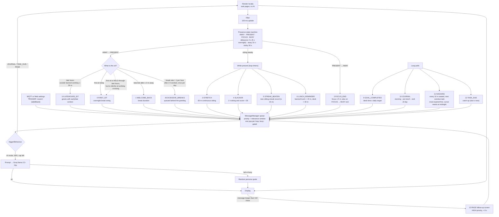
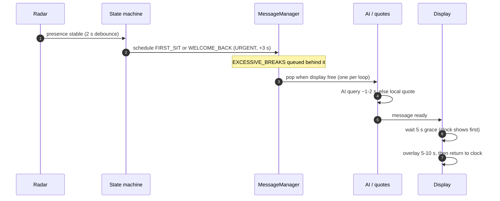

# DeskBuddy Behaviour System

How presence, state, triggers, and messages fit together, what each trigger does, and how they're timed. Companion to `doc/architecture.md` (system overview) and `doc/MQTTcommands.md` (debug trigger commands).

> Status: fixes F2–F15 implemented and committed. §6 (elective scheduler rework) is spec-only.

---

## 1. The pipeline at a glance

```
radar → presence state machine → trigger → MessageManager queue → AI or local quote → screen
```

- **Every trigger becomes a queued message.** The queue pops one per loop (busy-gated) in priority order, and a message that waits too long past its window expires.
- **AI-first with a local fallback.** Unless forced local, triggers go through Groq (daily cap 30); on failure or "AI busy" it falls back to a random persona quote instead of dropping the event. `JOURNAL`, `TASK_DUE` and `PAGE` always render locally (no AI).
- **Priorities** (higher pops first): `URGENT 3000 > HIGH 2250 > NORMAL 1500 > LOW 500`.
- **Relevance windows**: a queued message lives `URGENT 5m / NORMAL 30m / LOW 1h`, then is dropped.

## 2. How a trigger becomes a message



## 3. Timing reference

### Greeting timing (the sit-down path)



### Cadence per trigger

| Event | Cadence / threshold |
|-------|---------------------|
| `FIRST_SIT` | once per day — first work-hours sit |
| `LATEHOURS_SIT` | every sit during quiet hours |
| `WELCOME_BACK` | every return after ≥ 3 m away |
| `STRETCH` | every 60 m of continuous sitting |
| `SLACKER` | 1 h sitting, score < 35, throttled to 1 h |
| `STREAK_BEATEN` | once per session — new record ≥ 15 m |
| `FOCUS_END` | focus session ≥ 5 m ends |
| `LUNCH_REMINDER` | learned lunch + 15 m, desk > 30 m, once/day |
| `EXCESSIVE_BREAKS` | > 1 break/hour after 3 h worked, once/day |
| `GOAL_COMPLETED` | desk time ≥ target, once/day |
| `JOURNAL` | morning (5 m sit), pre-lunch (−15 m), end-of-day (−1 h), once each |
| `NAGGING` | every 10 m seated — next overdue task, most-expired-first; cursor persists across sessions, resets at midnight |
| `TASK_DUE` | catch-up: any task with due time ≤ now |
| `PAGE` | generated when a message exceeds 110 chars |
| `TRIGGER` | manual, any time |

## 4. Trigger registry

| ID | Event | Fired when | Site | Priority |
|----|-------|-----------|------|----------|
| 0 | `EVENT_FIRST_SIT` | first work-hours sit (flag held through late hours, burns silently at crossing) | `main.cpp:1140` | URGENT |
| 1 | `EVENT_WELCOME_BACK` | return after ≥ 3 m away | `main.cpp:1162` | URGENT |
| 2 | `EVENT_STRETCH` | 60 m continuous sitting | `main.cpp:1229` | NORMAL |
| 3 | `EVENT_FOCUS_END` | focus ≥ 5 m ends (in place, or on leave) | `main.cpp:1187` | NORMAL |
| 4 | `EVENT_SLACKER` | 1 h sitting, score < 35, throttled 1 h | `main.cpp:1242` | NORMAL |
| 5 | `EVENT_STREAK_BEATEN` | new sitting-streak record ≥ 15 m | `main.cpp:1254` | NORMAL |
| 6 | `EVENT_LUNCH_REMINDER` | learned lunch + 15 m, desk > 30 m, once/day | `main.cpp:1474` | NORMAL |
| 8 | `EVENT_EXCESSIVE_BREAKS` | > 1 break/hour after 3 h worked, once/day — always behind the greeting | `main.cpp:1157` | NORMAL |
| 9 | `EVENT_GOAL_COMPLETED` | desk time ≥ daily target, once/day | `main.cpp:1489` | HIGH |
| 10 | `EVENT_JOURNAL` | morning / pre-lunch / end-of-day, once each — local render | `main.cpp:1503` | HIGH |
| 11 | `EVENT_NAGGING` | every 10 m seated — next overdue task, most-expired-first; cursor persists, resets at midnight | `main.cpp:1599` | NORMAL |
| 12 | `EVENT_TASK_DUE` | due-task catch-up (due ≤ now) — local render | `main.cpp:628` | HIGH |
| 13 | `EVENT_PAGE` | follow-up screen for messages > 110 chars | `Display.h:554` | HIGH |
| 14 | `EVENT_LATEHOURS_SIT` | any sit during late hours (learned workday ± 30 m) | `main.cpp:1136` | URGENT |

Slot **7** was `EVENT_MQTT_MESSAGE` — removed (F7). Debug triggering now uses `TRIGGER` over MQTT (`deskbuddy/debug/cmd`) or the settings-page panel.

### Late-hours behaviour (F15)

A first sit during late hours is **held**, not burned: no greeting, no day-start, and stats are not reset. The flag burns either on a work-hours sit-down (normal `FIRST_SIT`) or **silently at the workday crossing** (`firstSitEpoch = sitDownEpoch`, so the late-hours span counts toward day stats). Quiet-hours sits of any duration get a `LATEHOURS_SIT` greeting instead. Net effect: no 1 a.m. "day journey" greetings, the morning `FIRST_SIT` always fires, and a blip that crosses into work hours behaves like the full span. The late-hours window is the learned workday padded by `LATEHOURS_PADDING_MS` (30 m) on **both** sides.

### Overdue-task nag queue

Each sit-down starts a 10 m clock (`NAGGING_TRIGGER_DELAY_MS`). When it rings, the nag names one overdue task — the next in most-expired-first order — and the clock restarts, so a long session is nudged about a different task every 10 m. The queue is built from **all** overdue tasks (daily, monthly past its due day, non-recurrent carried over, and recurrent monthly that missed an earlier month), so monthly overdues are nagged alongside daily ones. The AI nag prompt anchors on the queued task by name but explicitly allows citing the other overdue daily and monthly tasks from the observations. The cursor (`nagQueueIndex`, persisted in `stats.json`) advances per nag and is **not** reset on sit-down, so position carries across sessions; `resetDailyStats()` zeroes it at the day rollover so the whole list can be nagged again tomorrow. "Overdue" = any uncompleted daily task with a passed due date/time, a monthly task past its due day this month, or a recurrent monthly task that missed an earlier month. Known limitation: the cursor is positional, so a task completed before its turn shifts the list, and tasks that become overdue after the cursor passed them are not nagged until midnight.

### Task diligence in AI calls (F20)

Every AI prompt receives the persisted task-diligence tally: `getTodoObservations` computes done = total − uncompleted for the day and month, refreshes `appStats` via `updateTodoTally` (so the persisted snapshot/rings are current on every AI call, not just journal generation), and injects a line into `[TASK SYNTHESIS]`: `Diligence: daily N/M (+X), monthly N/M (-Y).` — same `2·done − total` signed score shown on the Web tally chips and journal DILIGENCE block. Note the observation-side daily total counts completed past-due non-recurrent tasks as active (they stay in the day's view until completed), so its `N/M` can differ from the journal dashboard's strictly-today count.

### Task carry-over & tallies (F17/F18)

Non-recurrent tasks carry forward until completed instead of vanishing at the period flip: a daily task due on a past date shows as **overdue** on every later day, and a monthly task stays in the list in every month after its target month. Recurrent monthly tasks carry too: if a month was missed (not in `completedMonths`), the task shows as **overdue from day 1** of the next month (badge `Overdue from MM/YYYY`) until it is completed that month. A recurrent task that missed a prior month appears **twice** in the current month's list — one entry `Overdue from MM/YYYY` for the missed occurrence and a second entry for the current month's occurrence (labelled `Due: Day X · Mon YYYY`, or `Overdue: Day X · Mon YYYY` once this month's day has passed) — so both the carried miss and the upcoming/current month show alongside each other. The Web todo page marks carried items with an `Overdue from dd/MM` (daily) or `Overdue from MM/YYYY` (monthly) badge, and shows a per-period tally — `N / M completed` — in the card headers. Each tally also carries a signed **diligence score** (`2·done − total`): green `+N` ahead, grey `0` balanced, red `-N` behind. The on-device journal dashboard shows the same as a **DILIGENCE** block with `Daily +N | Monthly -N` (green when the period is ahead/balanced, red when behind). Recurrent daily tasks are unchanged (`completedDates` reset each day), and deleting a recurrent task still truncates it at the selected period (`endDate`/`endMonth`), preserving earlier history. The AI synthesis, journal page, and nag queue all count carried tasks as overdue (the `3d+`/`3mo+` buckets apply to recurrent standing tasks only).

## 5. Known quirks

- **Nudge-storm (T1).** STRETCH every 60 m plus SLACKER hourly can queue and burst after a gap; relevance windows bound how stale they can get. Accepted.
- **Anti-repetition removed (Q1).** The stateless AI can't honor per-call "never reuse" instructions, so those clauses were dropped from the preambles; `PROMPT_BANNED` remains the repetition guard.
- **No output-length clamp (Q2).** The 75–85 char constraint isn't enforced; a long reply wraps/scrolls.
- **Voice parity (Q5).** NAGGING's prompt bans "Nudge:" but the local fallback quotes still use it.
- **English-only + weather (Q6).** All quotes/prompts are English; the weather URL typo is fixed (F5) but descriptions stay English.
- **No system-role separation (Q7).** Instructions and per-event content share one user message.
- **Constraint stacking (Q3)** and **"the user" substitution (Q4)** are known template wrinkles, low impact.

## 6. Fix history

| Fix | What changed |
|-----|--------------|
| F2 | `{score}` (+ desk/focus/break/time/streak/history placeholders) resolved in AI prompts |
| F3 | STREAK_BEATEN detail passes the *new* record |
| F4 / F4b | STRETCH/SLACKER/STREAK/FOCUS/LUNCH routed via MessageManager; no longer dropped while AI busy (local fallback) |
| F5 | weather URL `&leng=fr` → `&lang=fr` |
| F6 | removed dead code (unreachable switch cases, 7 unused MM methods), synced docs |
| F7 | removed MQTT display-alert feature; added `TRIGGER <event> [ai|fallback] [detail]` debug command |
| F8 | greeting (URGENT) always beats the excessive-breaks roast |
| F9 | split merged priority tiers → real 4-level ladder (URGENT 3000 > HIGH 2250 > NORMAL 1500 > LOW 500) |
| F10 | `checkDueTasks` → catch-up scheduler; LUNCH/JOURNAL/NAGGING queue while away |
| F11 | FOCUS_END celebrated in place on FOCUS → BUSY/REGULAR exit |
| F12 | `EVENT_PAGE` (13) follow-up screens for messages > 110 chars |
| F13 | MQTT triggers visible on screen (named event parsing + manual-trigger override for the away state) |
| F14 | compact `[TASK SYNTHESIS]` block (counts + names, ≤ 500 chars) injected into AI prompts; shuffled |
| F15 | quiet-hours handling: `EVENT_LATEHOURS_SIT` (14), held first-sit flag, silent crossing burn; `FOCUS_MINIMUM_MS` 15 s → 5 m |
| F16 | behaviour timing pass: STRETCH 45 → 60 m; EXCESSIVE_BREAKS needs 3 h worked (`EXCESSIVE_BREAKS_MIN_WORKED_HOURS`); late-hours padding moved to `LATEHOURS_PADDING_MS` and applied symmetrically; anti-repetition clauses dropped from the preambles; nagging rebuilt as an overdue-task queue (10 m cadence, one task per ring in most-expired-first order, persistent cursor reset at midnight, priority NORMAL) |
| F17 | non-recurrent tasks carry into later days/months as overdue until completed; Web todo page shows `Overdue from` badges and a per-period `N / M completed` tally; AI synthesis counts carried tasks (`3d+`/`3mo+` buckets now recurrent-only) |
| F18 | per-period **diligence score** `2·done − total`: Web todo tallies gain a signed `+N`/`0`/`-N` chip (green/grey/red); journal dashboard gains a DILIGENCE block (`Daily +N | Monthly -N`, green ahead/balanced, red behind) |
| F19 | task tallies persisted into `StatsState`: current-period snapshot (`dailyTaskDone/Total`, `monthlyTaskDone/Total` + period keys) and rolling history rings (last 7 days / 12 months) in `stats.json`; refreshed on each journal generation (`updateTodoTally`) |
| F20 | diligence available to AI calls: every prompt's `[TASK SYNTHESIS]` gains a `Diligence: daily N/M (±X), monthly N/M (±Y)` line; `getTodoObservations` also refreshes the persisted `appStats` tally on every AI call |

## 7. Proposed (not built): elective scheduler & annoyance budget

Today every elective message gets the same 30 m window (`NORMAL`), and `R_IMPORTANT` equals `R_NORMAL` — so a STRETCH can linger 30 m and burst behind the next nudge. Proposal: split into three windows, where the window *is* the anti-burst mechanism.

- **Critical — 12 h (`R_IMPORTANT`):** TASK_DUE.
- **Paced — 1 h (`R_NORMAL`):** FIRST_SIT, GOAL_COMPLETED, JOURNAL.
- **Slot — 2 m (`R_BRIEF`, new):** WELCOME_BACK, STRETCH, FOCUS_END, SLACKER, STREAK_BEATEN, LUNCH_REMINDER, EXCESSIVE_BREAKS, NAGGING, PAGE. Fire-now: dropped if the display can't show it within 2 m, never re-queued.

Call-site flags are set at schedule time, so a dropped message never refires that day. Tradeoffs: WELCOME_BACK at 2 m is safe (the greeting pops at sit + 3 s and holds the window itself); LUNCH/NAGGING/EXCESSIVE_BREAKS can be skipped if busy — intentional per anti-burst.

**Open questions:** keep three separate journal slots or one per day? Confirm `EVENT_PAGE` folds into the 2 m group.

## 8. Deferred / out of scope

Adaptive learning, persona memory, localization implementation, micro-break scoring (D7), focus-time lag (D8), bounded nagging list, FOCUS_END on BUSY exit (now mostly covered by F11). Localization prep notes (PROGMEM `LangStrings` struct, `.rodata` baseline 19.4 KB) live in the git history of this file.
